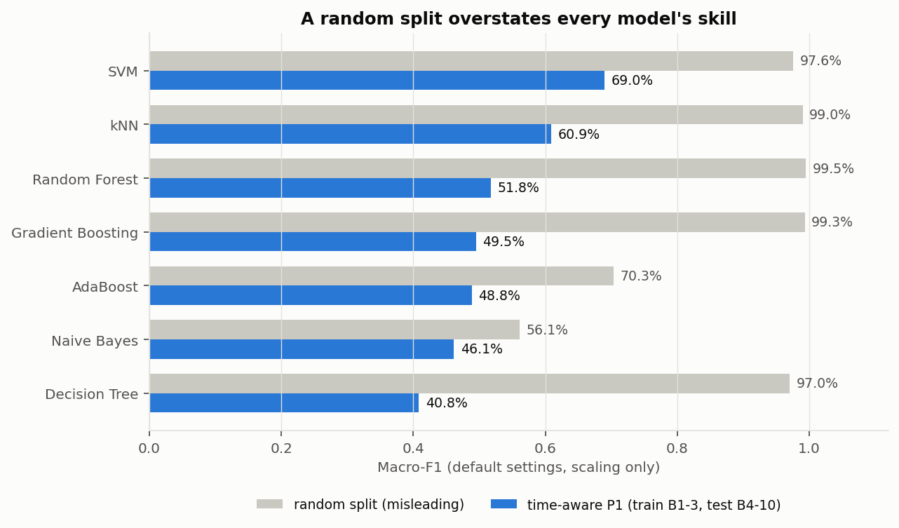
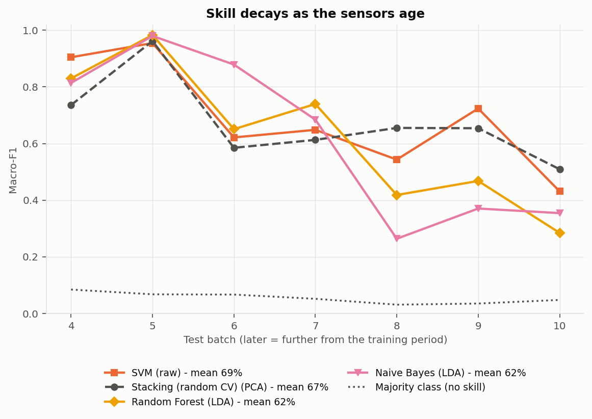

# Drift-Robust Gas Classification Using Machine Learning

**24DS601 - Machine Learning, M.Tech Data Science, Amrita Vishwa Vidyapeetham, Coimbatore**
Kiran Gautham (CB.AI.P2DSC26013)

> **Status: first review done; final phase in progress.** The first-review results below use scikit-learn **default settings**.
> Hyperparameter tuning (section 3b) and drift mitigation (section 3c) and interpretability (section 3d) and significance tests (section 3e) are done; a redesigned stacker and the final report are next.

## 1. Problem

An electronic nose uses an array of metal-oxide gas sensors and machine learning to identify gases. Sensors age, so the same gas produces
slowly changing readings - **sensor drift** - and a model trained on early data degrades on later data. The goal is a leakage-aware,
drift-aware classical-ML pipeline for gas classification, evaluated honestly: *train on the past, test on the future*.

**Dataset:** UCI *Gas Sensor Array Drift Dataset* (Vergara et al., 2012): 13,910 samples, 16 sensors x 8 features = 128 features,
6 gases (Ethanol, Ethylene, Ammonia, Acetaldehyde, Acetone, Toluene), recorded in 10 chronological batches over 36 months.

## 2. Method in brief

* **Pipelines** (always fitted on training batches only): `raw` = StandardScaler; `PCA` = scaler + PCA keeping 95% variance (11 components on batches 1-3);
  `LDA` = scaler + LDA with 5 axes.
* **Models** (scikit-learn defaults, `random_state=42`): kNN, SVM (RBF), Decision Tree, Random Forest, Gaussian Naive Bayes, AdaBoost, Gradient Boosting,
  plus a leakage-aware stacking ensemble and a "majority class" no-skill floor.
* **Time-aware protocols:** **P1** train on batches 1-3, test on each of 4-10 (headline); **P2** train on batch 1, test on 2-10;
  **P3** rolling: train on batches 1..k-1, test on batch k. Every test batch is scored separately.
* **Metrics:** accuracy, macro-precision, macro-recall, **macro-F1** (main metric; averaged over the gases present in the test batch), confusion matrices.
* **Leakage safety:** scaler/PCA/LDA are cloned and fitted on training batches only; stacking uses leave-one-batch-out folds; the random-split
  results exist only as a clearly labelled "misleading" reference. 61 automated tests check these properties.

## 3. Preliminary results (untuned)

Headline protocol P1 (train batches 1-3), mean over test batches 4-10:

| Model (best pipeline) | Accuracy | Macro-F1 |
|---|---|---|
| **SVM (scaling only)** | **70.5%** | **69.0%** |
| Stacking, random-fold meta-learner (PCA) | 70.8% | 67.3% |
| Random Forest (LDA) | 64.7% | 62.5% |
| Naive Bayes (LDA) | 63.2% | 62.1% |
| kNN (LDA; scaling only: 61.5% / 60.9%) | 64.0% | 61.0% |
| Stacking, leakage-safe batch folds (LDA) | 62.0% | 60.0% |
| AdaBoost (PCA) | 65.7% | 59.4% |
| Gradient Boosting (PCA) | 62.4% | 57.0% |
| Decision Tree (LDA) | 59.3% | 56.7% |
| *Majority class (no skill)* | *18.4%* | *5.5%* |

Other protocols: rolling **P3** best is SVM (scaling only) with 82.4% accuracy / 79.7% macro-F1; **P2** (batch 1 only) is weak for every model
(best: Naive Bayes 41.3% and Random Forest 41.0% macro-F1; no model above 49% accuracy).



### Findings

1. **A random split overstates performance by 10-56 macro-F1 points**: SVM 97.6% (random) vs 69.0% (time-aware), kNN 99.0% vs 60.9%, Random Forest 99.5% vs 51.8%.
   The sensor readings reveal which batch (time period) a sample comes from with 99.2% accuracy (chance 26.0%), so a random split leaks.
2. **Drift is visible and uneven.** For Ethanol, 36% of sensor-batch combinations respond more than 2x differently from batch 1; sensor S01 falls to about 1/24 of its batch-1 response by batch 8.
   Skill decays with distance in time and is not monotonic; batch 10 is among the hardest.
3. **Distance-based models age best.** On raw features, macro-F1 on near (batches 4-5) vs far (batches 8-10) test batches: SVM 93.0% to 56.6%, kNN 77.6% to 51.1%,
   but Naive Bayes 82.8% to 20.2% and Random Forest 77.5% to 31.7%.
4. **PCA/LDA have no universal effect.** They raise trees, Naive Bayes and boosting by up to 16 macro-F1 points on P1 but lower SVM; LDA is the least drift-robust on distant batches and collapses when trained on one batch.
5. **Stacking did not help with default settings.** The leakage-safe stacker (54.0% macro-F1, scaling only) is below SVM; a diagnostic points to uneven out-of-fold predictions
   (e.g. SVM only 53.7% accurate when batch 1 is held out). Forward-chaining folds are the next idea to test.
6. **Toluene is a hidden confound in P1.** Toluene is only 79 of 3,275 training samples (2.4%, 74 from batch 1), and no model recognises it on later batches
   (recall at most 12%). Excluding it from the average lifts SVM from 69.0% to 77.4% macro-F1, so part of the P1 penalty is data scarcity rather than drift.
   Drift remains real: SVM accuracy on non-Toluene samples is 51.7% on batch 10.



### 3b. Hyperparameter tuning (final phase, step 8)

Settings were chosen on batches 1-3 only, with forward-chaining validation (train B1 / validate B2, train B1+B2 / validate B3), then tested on the untouched batches 4-10.
Every grid contains the default setting. **Result: tuning did not improve the headline.** It raised validation macro-F1 by +0.069 on average, but on the test batches the mean change is -0.002
(3 of 21 model/pipeline combinations improved, 11 got worse, 7 unchanged). The tuned SVM (scaling only) has the highest accuracy so far, 72.4% (default 70.5%), but a lower macro-F1, 67.0% (default 69.0%).
Validation gains did not predict test gains (only AdaBoost, whose default is very weak, gained). Details: `notebooks/07_tuning.ipynb`.

### 3c. Drift mitigation (final phase, step 9)

Four simple methods were tested with default-setting models, with their settings declared before running (window 2, half-life 2, CORAL regularisation 1.0): sliding-window retraining and recency weighting
(need recent labels), per-batch standardisation and CORAL (need no labels, but use the unlabelled readings of the test batch; test labels are never used, and a test checks this).
**Result: nothing beat simply retraining on all available history.** Under the rolling protocol P3 the mean change in macro-F1 relative to that baseline was -0.130 / -0.073 / -0.020 for windows of 1 / 2 / 3 batches,
-0.004 for recency weighting (half-life 2), -0.074 for per-batch standardisation and -0.118 for CORAL (SVM with scaling only: baseline 79.7%, best mitigation 78.5%).
Short windows are harmful mainly because several batches are tiny (161-470 samples). With the fixed training set P1 the two unlabelled-target methods gave mixed results (per-batch standardisation raised raw-feature Random Forest, Naive Bayes and kNN by 0.5-4.5 points
but lowered SVM and every LDA pipeline); none beat the default SVM (69.0%). Details: `notebooks/08_drift_mitigation.ipynb`.

### 3d. Interpretability (final phase, step 10)

Feature scores and any selection use batches 1-3 only; permutation importance and ablations are descriptive analyses of a fitted model. **The most informative sensors are also the ones that drift most**:
in the training batches S01, S02, S09 and S10 separate the gases best but drift most (the sensors that stood out in the exploratory analysis), and used alone they are the worst later on (macro-F1 0.32-0.35 vs 0.55-0.59 for S08, S04, S07).
Removing S01 lifts the SVM from 0.690 to 0.723 on the fixed training set (and kNN from 0.609 to 0.648), but not under rolling retraining. Choosing features by training discriminability **hurts** (SVM 0.584 with the discriminative half),
while the pre-declared drift-stable half (which contains none of S01, S02, S09, S10) raises Random Forest from 0.518 to 0.639 (better than all 50 random halves; but only *suggestive* once batch-to-batch uncertainty is included, section 3e), is neutral for the SVM (0.683) and inconsistent for kNN.
Features are highly redundant: no single feature type or sensor group matches the full set. Details: `notebooks/09_interpretability.ipynb`.

### 3e. Significance tests and confidence intervals (final phase, step 12)

All 97 stored predictions reproduce the earlier per-batch results exactly. Intervals come from a paired **two-level bootstrap** (test batches *and* the samples inside them are resampled, because samples within a batch are near-identical twins),
with a pre-declared verdict rule (clear / suggestive / inconclusive). **The best default model, SVM with scaling only, scores 0.690 macro-F1 with a 95% interval of 0.567-0.821**; the intervals of the other models overlap heavily
(kNN 0.528-0.697, Random Forest 0.364-0.672, no-skill floor 0.041-0.069). Of 37 declared comparisons, 24 are clear, 12 suggestive and 1 inconclusive: SVM beats all six other models (7 of 7 batches against five of them), but a Friedman/Nemenyi rank test only separates
it from AdaBoost, Naive Bayes and Decision Tree; windows, CORAL and the leakage-safe default stacker clearly hurt; selecting features by training discriminability clearly hurts; tuning, per-batch standardisation, recency weighting and the Random Forest stable-half gain are only suggestive.
**After Holm correction no single comparison is significant at 5%** (smallest adjusted p = 0.145), which is unavoidable with only 7 or 9 test batches. Details: `notebooks/10_significance.ipynb`.

### Limitations

Untuned defaults in the first-review table; one fixed seed; several small, class-imbalanced test batches (4, 5, 8) and no confidence intervals or significance tests yet, so differences of a few points
are within noise; the P1 training set contains almost no Toluene; this dataset copy has no raw baseline readings, so the Dennler et al. (2022) leakage concern was tested only indirectly.
Rankings above are descriptive - choosing a final model from test-batch scores would be tuning on the test set.

## 4. Repository layout

```
data/raw/        batch1.dat ... batch10.dat (git-ignored; see data/raw/README.md)
src/             data.py (loader), evaluate.py (protocols, metrics), models.py, stacking.py, tuning.py, mitigation.py, interpret.py, predictions.py, stats.py, plotting.py
notebooks/       01_eda_drift  02_evaluation_framework  03_pca_lda  04_baselines  05_stacking  06_results  07_tuning  08_drift_mitigation  09_interpretability  10_significance
scripts/         run_stacking.py, run_random_baselines.py, run_tuning.py, run_mitigation.py, run_interpretability.py, run_predictions.py (heavy runs that cache their results)
tests/           61 tests (chronological splits, no leakage, metrics, stacking folds, tuning rules, mitigation methods, interpretability, statistics)
results/         CSV tables and results/figures/ (39 figures)
docs/            first_review_slides.md (slide-by-slide outline for the review)
```

## 5. Reproduce

```bash
pip install -r requirements.txt
# download the UCI dataset and place batch1.dat ... batch10.dat in data/raw/
python -m pytest tests -q
cd notebooks && jupyter nbconvert --to notebook --execute --inplace 01_eda_drift.ipynb   # repeat for 02 ... 06
```

Run notebooks from inside `notebooks/` (they locate the project root from there). Notebooks 04-06 reuse the cached CSVs in `results/` and finish in seconds;
to recompute from scratch set `RERUN = True` in the notebook, or run the scripts. Approximate full-recompute times on 16 CPU cores:
notebook 04 about 28 min, `scripts/run_stacking.py` about 23 min, `scripts/run_tuning.py` about 14 min, `scripts/run_mitigation.py` about 2 min, `scripts/run_interpretability.py` about 5 min, `scripts/run_predictions.py` about 13 min, `scripts/run_random_baselines.py` about 7 min; everything else takes under a minute.

## 6. Roadmap (final phase)

Gas-aware drift compensation (the simple methods of section 3c did not help); a redesigned stacker (forward-chaining folds); a Toluene-aware evaluation with per-gas reporting; final report.

## References

1. Vergara, A., Vembu, S., Ayhan, T., Ryan, M. A., Homer, M. L., & Huerta, R. (2012). Chemical gas sensor drift compensation using classifier ensembles. *Sensors and Actuators B: Chemical*, 166-167, 320-329. DOI: 10.1016/j.snb.2012.01.074
2. Vergara, A. (2012). Gas Sensor Array Drift Dataset. UCI Machine Learning Repository. DOI: 10.24432/C5RP6W
3. Dennler, N., Rastogi, S., Fonollosa, J., van Schaik, A., & Schmuker, M. (2022). Drift in a popular metal oxide sensor dataset reveals limitations for gas classification benchmarks. *Sensors and Actuators B: Chemical*, 361, 131668. DOI: 10.1016/j.snb.2022.131668
4. Zhang, Y., Xiang, S., Wang, Z., Peng, X., Tian, Y., Duan, S., & Yan, J. (2022). TDACNN: Target-domain-free domain adaptation CNN for drift compensation in gas sensors. *Sensors and Actuators B: Chemical*, 361, 131739. DOI: 10.1016/j.snb.2022.131739
5. Jiang, K., et al. (2025). Gas sensor drift compensation using semi-supervised ensemble classifiers with multi-level features and center loss. *ACS Sensors*, 10(4), 2906-2918. DOI: 10.1021/acssensors.4c03655
6. Lin, J., & Zhan, X. (2026). Sensor-drift compensation in electronic-nose-based gas recognition using knowledge distillation. *Informatics*, 13(1), 15. DOI: 10.3390/informatics13010015
